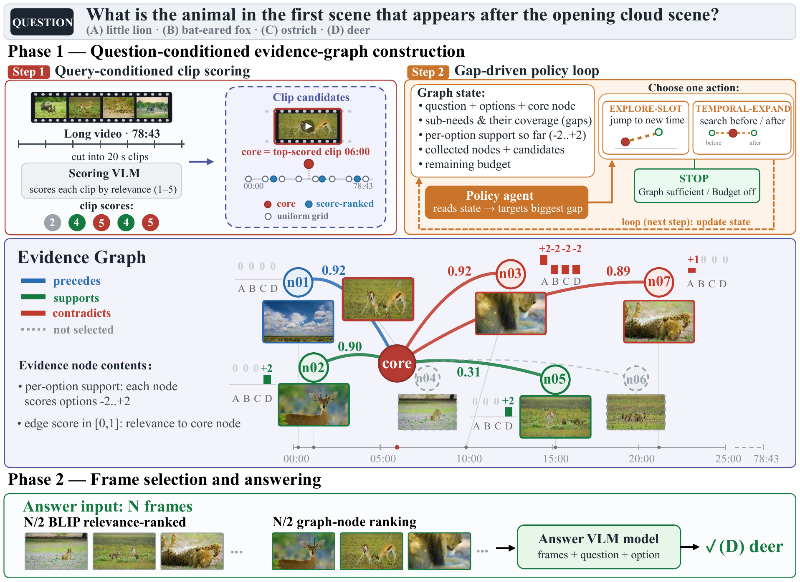

# EviGraph: Evidence-Graph Frame Selection for Long-Video Question Answering

Code for the ACCV 2026 paper by Ning Ding, Keisuke Fujii and Toru Tamaki.



## Installation

```bash
conda create -n evigraph python=3.10 -y && conda activate evigraph
pip install -r requirements.txt
```

This environment covers feature extraction, graph building through an API, frame
selection and the Qwen3-VL-8B backbone. The other backbones need their own
environments: mPLUG-Owl3 runs with `transformers<4.48` (its remote code), and
LLaVA-Video needs the [LLaVA-NeXT](https://github.com/LLaVA-VL/LLaVA-NeXT) package
(`LLAVA_NEXT_DIR` if it is not pip-installed). Open-source graph builders are served
with [vLLM](https://github.com/vllm-project/vllm), preferably in a separate environment.

## Data

| benchmark | questions used | setting |
|---|---|---|
| [LVBench](https://github.com/zai-org/LVBench) | 1,242 of 1,549 (videos available in our download) | test |
| [LongVideoBench](https://huggingface.co/datasets/longvideobench/LongVideoBench) | 564 | val, (900, 3600] s |
| [Video-MME](https://github.com/MME-Benchmarks/Video-MME) | 900 | Long, without subtitles |

Set the dataset locations in `scripts/env.sh` (copy `scripts/env.example.sh`). By
default every command evaluates exactly the questions of the paper
(`evigraph/splits/`); `--split all` uses every question whose video is available.

## Running

```bash
source scripts/env.sh

# 1. 1 fps BLIP-ITM relevance (per question) and CLIP-L features (per video); GPU
python -m evigraph.precompute blip --dataset lvb
python -m evigraph.precompute clip --dataset lvb

# 2. Phase 1: evidence graphs (no local GPU needed)
python -m evigraph.build_graphs --dataset lvb --builder gpt-5.4-mini --workers 12

# 3. Phase 2 + answering with a frozen backbone
python -m evigraph.answer --dataset lvb --selector evigraph --frames 32 --backbone qwen
```

`--selector` is one of `evigraph`, `uniform`, `aks`, `videotree`, `lvnet`; all of them
feed the same backbone with the same prompt. Results (per-question selected frames,
raw output and correctness) are written to `outputs/results/<tag>.json`; interrupted
runs resume. `scripts/run_benchmark.sh` runs every selector and budget.

### Open-source graph builders (no API cost)

Any OpenAI-compatible endpoint can build the graphs. With vLLM:

```bash
bash scripts/serve_builder.sh OpenGVLab/InternVL3-8B-hf 8000 0      # terminal 1
export OPENAI_BASE_URL=http://127.0.0.1:8000/v1 OPENAI_API_KEY=EMPTY  # terminal 2
python -m evigraph.build_graphs --dataset lvb --builder OpenGVLab/InternVL3-8B-hf --workers 16
python -m evigraph.answer --dataset lvb --selector evigraph --graph_tag OpenGVLab/InternVL3-8B-hf \
    --frames 32 --backbone qwen
```

Graphs are stored per builder (`outputs/graphs/<graph_tag>/`, the tag being the model id
with `/` replaced by `--`). The paper evaluates InternVL3-8B, Qwen3-VL-8B, Qwen3-VL-2B and
Qwen2.5-VL-7B as builders.

### LVNet baseline

LVNet extracts a keyword bag from the answer options with an LLM (any OpenAI-compatible
model, e.g. the vLLM server above) and ranks frames by BLIP-ITM relevance to it:

```bash
python -m evigraph.precompute lvnet --dataset lvb --keyword_model gpt-5.4-mini
python -m evigraph.answer --dataset lvb --selector lvnet --frames 32 --backbone qwen
```

## Citation

```bibtex
@inproceedings{ding2026evigraph,
  title     = {EviGraph: Evidence-Graph Frame Selection for Long-Video Question Answering},
  author    = {Ding, Ning and Fujii, Keisuke and Tamaki, Toru},
  booktitle = {Proceedings of the Asian Conference on Computer Vision (ACCV)},
  year      = {2026}
}
```

AKS's `meanstd` selection is taken from [ncTimTang/AKS](https://github.com/ncTimTang/AKS);
VideoTree and LVNet are re-implemented on the same features as EviGraph.
